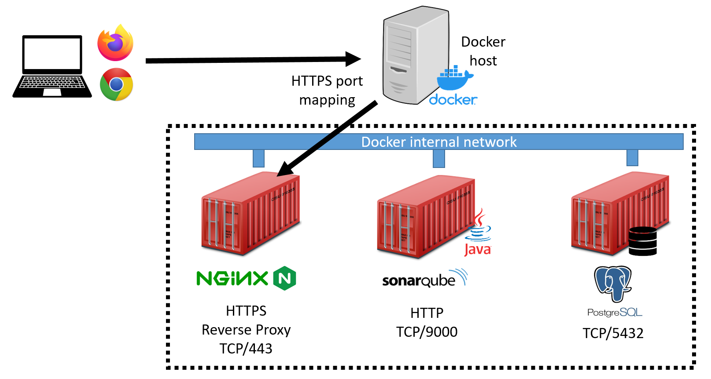

# A containerized, automated SonarQube deployment

Quick setup instructions for a modern, tiny-yet-good [SonarQube](https://www.sonarqube.org/) on-premises deployment.

We'll do it in the [IaC](https://en.wikipedia.org/wiki/Infrastructure_as_code) way, using [Docker Swarm](https://docs.docker.com/engine/swarm/) and [Ansible](https://www.ansible.com/).

At the end, it will look like this (here we have a dummy, single-node Swarm):



[NGINX](https://www.nginx.com/) will be used as [TLS-offloading](https://en.wikipedia.org/wiki/TLS_termination_proxy) HTTPS reverse proxy.

[PostgreSQL](https://www.postgresql.org/) will be our database.

Let's go!

- install [Docker](https://docs.docker.com/get-docker/) and create a [Swarm](https://docs.docker.com/engine/swarm/swarm-tutorial/)
- set your *vm.max_map_count* to [the right value](https://github.com/SonarSource/docker-sonarqube/issues/282):

  ```
  sudo echo "vm.max_map_count=262144" >> /etc/sysctl.conf
  ```
- clone this repo to your *Ansible* machine

  ```
  git clone https://github.com/marcobellaccini/sonarqube-stack.git
  ```
- prepare your [Ansible-Vault](https://docs.ansible.com/ansible/latest/user_guide/vault.html)-encrypted configuration files:

  ```
  ansible-vault create secrets/postgres_db # file containing db name

  ansible-vault create secrets/postgres_user # file containing PostgreSQL username

  ansible-vault create secrets/postgres_password # file containing PostgreSQL password

  ansible-vault create secrets/sonar.properties # sonarqube config file (with db connection specs: see https://docs.sonarqube.org/latest/setup/install-server/ )

  ansible-vault encrypt secrets/sonarqube.key # encrypt cert private key for HTTPS

  # certificate for HTTPS should be put in secrets/sonarqube.crt
  ```

- edit Ansible inventory (*inventory.yml*) 

- deploy everything with *Ansible*:

  ```
  ansible-playbook -i inventory.yml sonarqube.yml -u <SSHUSER> --ask-pass --ask-become-pass
  ```
  Of course, you will be better off with ssh public key authentication!
